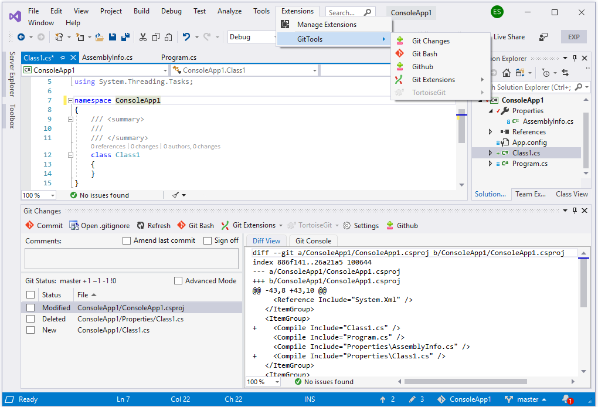

# Git Tools and Git Tools 2019
## Introduction

[Git Tools](https://marketplace.visualstudio.com/items?itemName=yysun.GitTools) is a Visual Studio extension that integration a few more git tools to Visual Studio 2013/2015/2017, including git changes window, graphical git history viewer and menus to launch Git Bash, Git Extensions and TortoiseGit.

 [Git Tools 2019](https://marketplace.visualstudio.com/items?itemName=yysun.git-tools-2019) supports the new Visual Studio 2019 extension architecture. It is compiled from the VS2019 branch.

> Please [donate](https://www.paypal.com/cgi-bin/webscr?cmd=_donations&business=KBCLF3PZD6C98&lc=US&item_name=Git%20Tools%20for%20Visual%20Studio&currency_code=USD&bn=PP%2dDonationsBF%3abtn_donate_SM%2egif%3aNonHosted) or [support the project on Patreon](https://www.patreon.com/gittools). 👍❤️🙏

## History

Git Tools and Git Tools 2019 are the successors of [Git Source Control Provider](https://visualstudiogallery.msdn.microsoft.com/63a7e40d-4d71-4fbb-a23b-d262124b8f4c).

[Git Source Control Provider](https://marketplace.visualstudio.com/items?itemName=yysun.GitSourceControlProvider) was the Visual Studio extension for Visual Studio 2008/2010. It integrates Git tools to Visual Studio as a source control provider since Visual Studio 2008 ([Github Project](https://github.com/yysun/Git-Source-Control-Provider)) ([InfoQ News](https://www.infoq.com/news/2010/06/Git-Visual-Studio)). Starting in Visual Studio 2013, Microsoft has built the Microsoft Git provider into Visual Studio, but Visual Studio remains allowing only one active source control provider at a time. [Git Tools](https://marketplace.visualstudio.com/items?itemName=yysun.GitTools) is modified from the Git Source Control Provider to become a standalone extension. It is compatible with Microsoft Git and can run side by side with Microsoft Git.

Visual Studio 2019 has a new asynchronous extension architecture. [Git Tools 2019](https://marketplace.visualstudio.com/items?itemName=yysun.git-tools-2019) is modified from Git Tools to adopt the new architecture. It is compiled from the VS2019 branch.

## Screenshot of Visual Studio 2017

## Screenshot of Visual Studio 2019

For more information, please visit http://yysun.github.io/git-tools

## How to Use

* Install [Git for Windows](http://code.google.com/p/msysgit), [Git Extensions](https://gitextensions.github.io) (optional) or [TortoiseGit](http://code.google.com/p/tortoisegit) (optional).
* Run Visual Studio.
* Go to Tools | Extensions, and Updates..., search the online gallery for Git Tools and install.
* Select Top Menu 'Git Tools' or add 'Git Tools' toolbar to the main window.

## Compile Source Code

* Get source code: _git clone https://github.com/yysun/git-tools.git_
* Open the solution and compile it in Visual Studio 2017
* Or checkout branch VS2019 and open the solution in Visual Studio 2019

Pull requests are welcomed

## Change Logs

### 5.0.0

* Support Visual Studio 2022

### 3.0.0

* Support Visual Studio 2019

### 2.0.0

* Added advanced mode: displays un-staged changes and staged changes as two lists
* Added advanced mode: allows stage/un-stage/reset by selecting line(s)
* Improved Git Console autocomplete
* Support git commit.template settings

### 1.6.0

* Upgrade solution for VS 2017 RC, support VS 2017 RC

### 1.5.0

* Performance enhancement: Use the background thread to refresh git changes
* Performance enhancement: Use background thread to stage multiple files
* Performance enhancement: Not to refresh if the changed files are ignored by git
* Copy Dragon.exe to the Documents folder instead of the temp folder
* Support VS community and Enterprise Editions
* Bug fixes

### 1.4

* Add git console

### 1.3

* Add compare menu in changed file list to launch visual studio diff viewer
* Add more context menu to git history viewer, e.g. init, stash, cherry pick, rebase, merge and etc.
* Re-work on the refresh logic

### 1.0

* Migrated from [Git Source Control Provider](https://github.com/yysun/Git-Source-Control-Provider)
